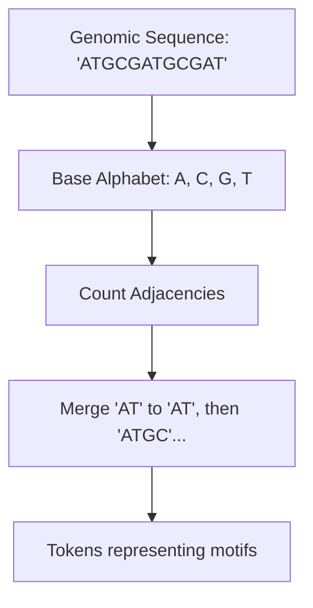

# Bioinformatics (Protein & DNA Analysis)

In bioinformatics, biological sequences (like amino acids or DNA nucleotides) lack natural "word" boundaries. BPE is used to discover frequent recurring motifs and compress sequences into informative representations.

## Mechanism
1. **Initial Alphabet**: Set the base vocabulary to the 4 bases (A, C, G, T) for DNA or 20 standard amino acids for proteins.
2. **Motif Discovery**: Apply BPE to recursively merge frequent sequence pairs.
3. **Biological Vocabulary**: The resulting tokens correspond to common biological motifs (such as codon blocks, binding sites, or structural domains).

## Advantages
- **Unsupervised Motif Learning**: Discovers functional motifs directly from raw sequence data without biological annotation.
- **Improved Context Length**: Compresses long genetic sequences, allowing Transformer models to fit entire genes into their context window.

## Limitations
- **Loss of Resolution**: If tokenization is too coarse, it may obscure single-point mutations (SNPs) which are critical for disease analysis.

[Back to README](../README.md)
