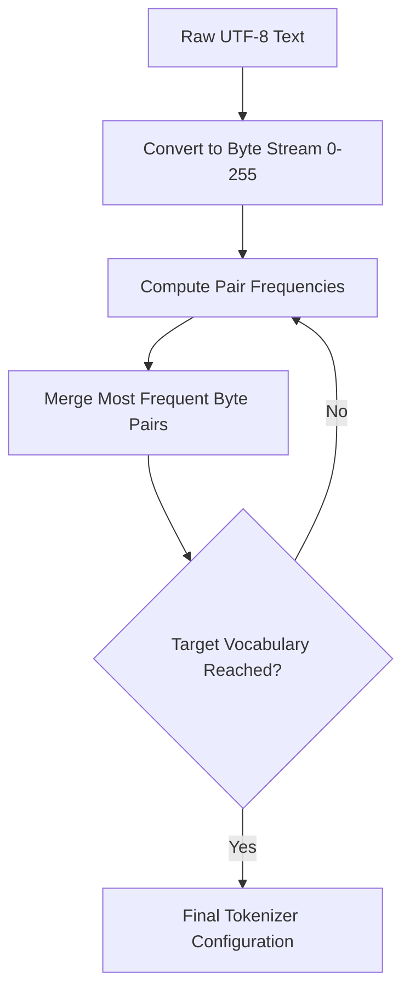

# Byte-Level BPE (BBPE)

Byte-Level Byte-Pair Encoding (BBPE) performs BPE directly on raw byte sequences rather than Unicode characters (UTF-8 strings).

## Mechanism
1. **Byte Representation**: Convert text to raw UTF-8 bytes. The base vocabulary ($V_0$) is fixed at the 256 possible byte values.
2. **Iterative Merging**: Identify the most frequent byte pairs in the training corpus and merge them into larger subword tokens.
3. **Preventing Space/Punctuation Merges**: Often combined with regex restrictions to prevent bytes from merging across structural boundaries (e.g. whitespace, punctuation).

## Advantages
- **Zero OOV (Out-of-Vocabulary)**: Since the base vocabulary contains all 256 byte values, any sequence of characters (including rare emojis, mathematical symbols, or unknown languages) can be represented.
- **Compact Base Vocabulary**: The initial vocabulary is only 256 elements, making embedding tables smaller at the start.

## Limitations
- **Noisy Embeddings**: May occasionally merge bytes across characters in a way that lacks semantic meaning if pre-tokenization boundaries are not strictly defined.

[Back to README](../README.md)
