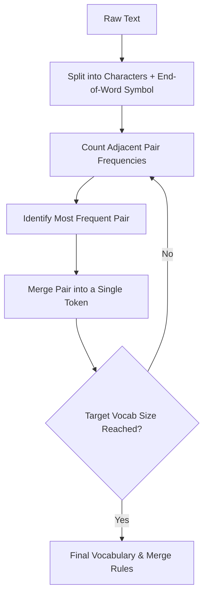

# Character-Level BPE (Classic)

Character-Level Byte-Pair Encoding (BPE) adapts the classic data compression algorithm to the task of subword tokenization in Natural Language Processing (NLP).

## Mechanism
1. **Initialize Vocabulary**: Start with all unique characters in the text dataset as the initial vocabulary ($V_0$).
2. **Word Pre-splitting**: Split all training words into individual characters, adding a special end-of-word marker (e.g., `</w>`).
3. **Iterative Merging**: Count the frequencies of all adjacent pairs of symbols. Merge the most frequent pair to form a new subword unit and add it to the vocabulary.
4. **Repeat**: Repeat the merging step for a target number of operations or until the desired vocabulary size is reached.

## Advantages
- **Reduces Out-of-Vocabulary (OOV) Issues**: Can represent unseen words by breaking them down into constituent characters or smaller subwords.
- **Data-Driven**: Dynamically learns vocabulary based on character co-occurrence patterns in the corpus.

## Limitations
- **Boundary Mix-ups**: Easily breaks across word boundaries (e.g., suffix of one word mixing with prefix of another) unless handled with strict word splitters.
- **Large Vocab for Non-Latin Languages**: For languages with extensive character sets (like Chinese, Japanese, or Korean), the base vocabulary is very large.

[Back to README](../README.md)
