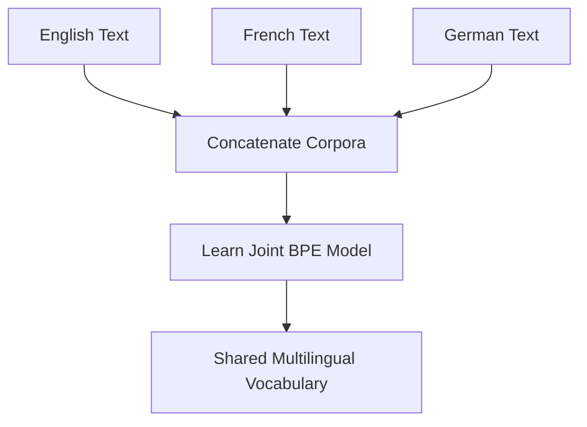

# Cross-Lingual Vocabulary Compression

Cross-Lingual Vocabulary Compression uses a shared BPE vocabulary across multiple languages to encourage representation alignment and reduce parameter overhead in multilingual models.

## Mechanism
1. **Corpus Concatenation**: Concatenate multilingual corpora during the BPE training phase.
2. **Joint BPE Training**: Train a single BPE model on the combined corpus, creating a shared vocabulary.
3. **Cognate Sharing**: Automatically maps shared roots, numbers, and named entities (e.g., `Paris` in English, French, and German) to the same token.

## Advantages
- **Cross-Lingual Alignment**: Forces shared vocabulary spaces, helping translation models align word representations.
- **Resource Savings**: Parameter footprint is dramatically reduced compared to having separate vocabulary tables for each language.

## Limitations
- **Vocabulary Starvation**: Low-resource languages with different alphabets may get fewer tokens, causing their text to be over-segmented into single characters.

[Back to README](../README.md)
