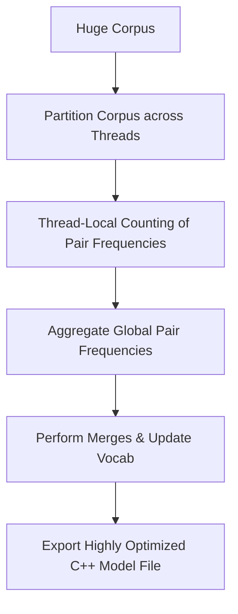

# FastBPE

FastBPE is a highly optimized C++ implementation of Byte-Pair Encoding designed for extreme performance during massive pre-training data tokenization pipelines.

## Mechanism
1. **Parallel Training**: Counts token pairs using multiple threads over partitioned chunks of the training data.
2. **C++ Core**: Written in clean C++ with efficient hash maps and array structures to avoid overhead.
3. **Python Wrapper**: Provides a simple Python API that interfaces directly with the compiled binary.

## Advantages
- **Extremely Fast**: Orders of magnitude faster than naive Python-based tokenization models.
- **Multithreaded**: Can utilize multiple CPU cores for large dataset indexing.

## Limitations
- **Compiling Overhead**: Requires a C++ compiler to build, which can make deployment in some environments more difficult.

[Back to README](../README.md)
