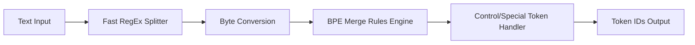

# GPT-Style Tokenizer (tiktoken / Hugging Face)

GPT-Style tokenization refers to the optimized Byte-Level BPE tokenizer architectures used in OpenAI's models (such as GPT-2, GPT-3, GPT-4, cl100k_base) and implemented in libraries like `tiktoken`.

## Mechanism
1. **RegEx Pre-tokenization**: Uses optimized regex boundaries to split the text.
2. **Byte-Pair Encoding (BPE)**: Performs merging over raw bytes.
3. **Lookup Cache & Optimization**: Implements high-performance merge rules using lookup tables (often written in Rust or C++) to drastically speed up processing.
4. **Special Tokens**: Reserves tokens for control signals (e.g. `<|endoftext|>`, `<|fim_prefix|>`).

## Advantages
- **Extremely Fast**: highly optimized versions like `tiktoken` execute in parallel at multiple megabytes of text per second.
- **Widespread Compatibility**: Standardized across API endpoints, making token counts reproducible.

## Limitations
- **Opaque Logic**: Heavy regex splits can make the exact reasons for vocabulary choices difficult to interpret semantically.

[Back to README](../README.md)
