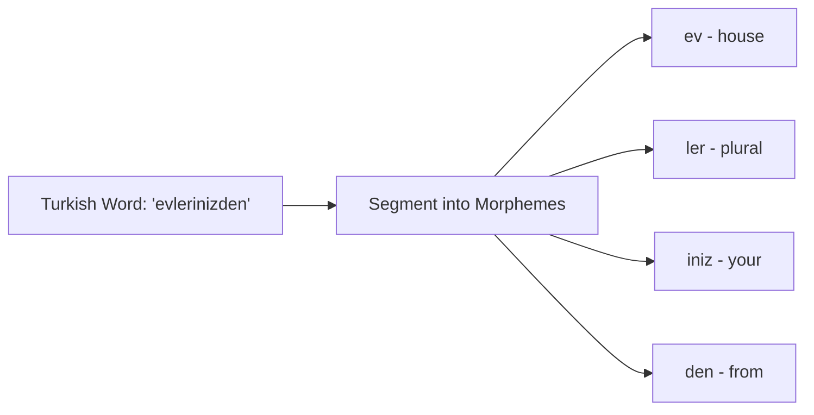

# Morphological Handling in Agglutinative Languages

Agglutinative languages form words by chaining suffixes (morphemes) together to represent grammatical functions, which creates an infinite possible vocabulary. BPE is used to decompose these complex words into their base roots and suffixes.

## Mechanism
1. **Root Extraction**: Identifies the base morpheme or root of the word.
2. **Suffix Chaining**: Matches suffix boundaries so that they can be tokenized as distinct subunits instead of separate, unrelated words.
3. **Vocab Management**: Prevents the vocabulary from ballooning when handling millions of different inflected forms of a single root.

## Advantages
- **Linguistic Logic**: Allows models to learn the rules of inflection and grammatical case markings without needing every combined form in the vocabulary.
- **Robustness**: Handles new compound words natively.

## Limitations
- **Over-segmentation**: If BPE is too aggressive, it may split roots into meaningless components (like `e` and `v` instead of `ev`), destroying semantic understanding.

[Back to README](../README.md)
