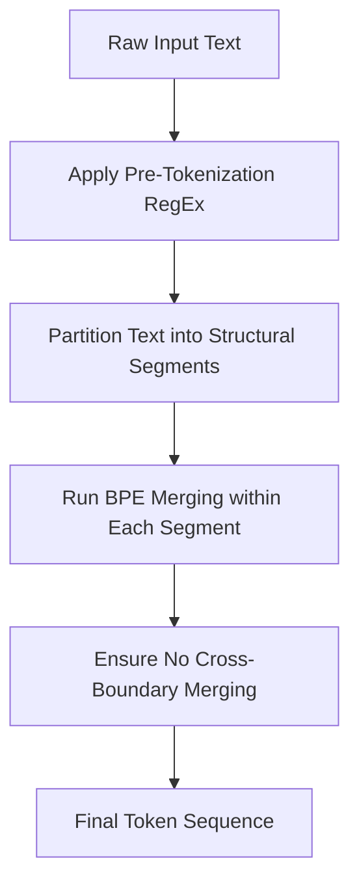

# RegEx-Guided BPE

RegEx-Guided BPE applies strict, handcrafted regular expressions to segment text into logical chunks (like words, numbers, or whitespace structures) before running BPE merges.

## Mechanism
1. **RegEx Splitting**: Run a regex parser over raw text. For example, GPT-2 uses a regex that separates words, contractions, numbers, and spaces.
2. **Restricted Merging**: Run BPE merges *only* within the segments generated by the regex. Merges are strictly forbidden from crossing boundaries (e.g., merging a word like `dog` with a following period `.`).

## Advantages
- **Linguistic Integrity**: Protects suffixes, punctuation, and formatting boundaries from being merged together.
- **Structural Safety**: Preserves mathematical digits and indentation patterns, which is critical for programming languages and code models.

## Limitations
- **Linguistic Bias**: RegEx patterns must be designed carefully, or they might split words in ways that hurt model learning for certain languages.

[Back to README](../README.md)
