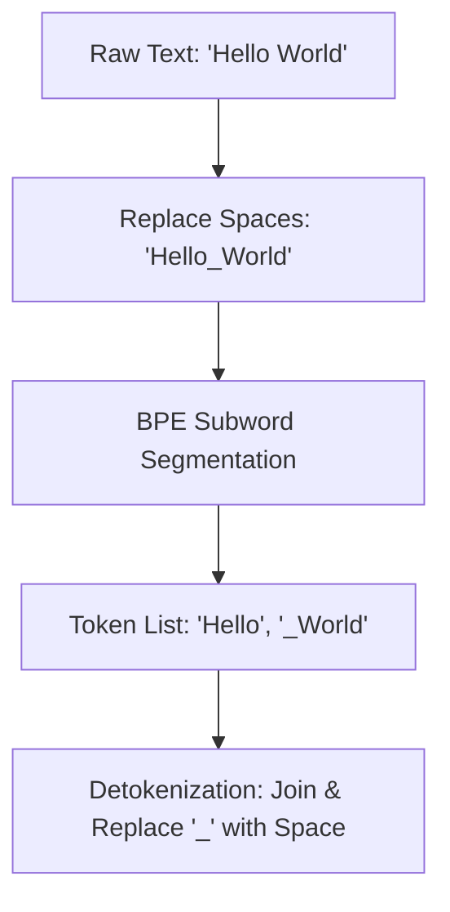

# SentencePiece BPE

SentencePiece is a language-independent subword tokenizer that treats the input text as a raw temporal sequence, treating spaces as native characters represented by a structural block token `_`.

## Mechanism
1. **Whitespace as Character**: Instead of pre-splitting words by whitespace, spaces are replaced with the special symbol `_` (U+2581).
2. **Lossless Detokenization**: Because all spaces are encoded, the original text can be reconstructed exactly without a custom de-tokenizer.
3. **BPE Implementation**: Runs the classic BPE sequence-compression algorithm over the unified unicode character sequence.

## Advantages
- **Language-Independent**: Works out-of-the-box for languages without spaces (such as Chinese, Japanese, or Thai).
- **Lossless**: Reversing tokenization is a simple string-join and replace operation.

## Limitations
- **Tokenizer Metadata**: Needs a model file (binary format) stored locally, unlike simpler text-based merge rules.

[Back to README](../README.md)
