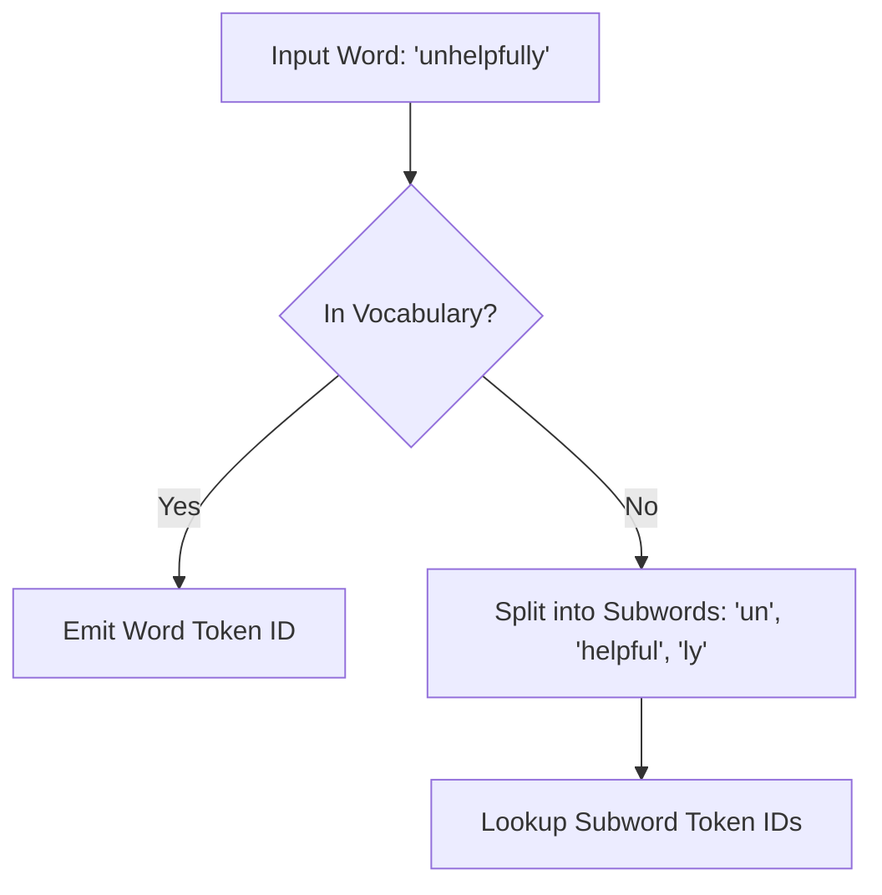

# Subword Language Modeling

Subword Language Modeling balances vocabulary size and sequence length in large language models by splitting words into smaller, statistically frequent units.

## Mechanism
1. **Frequent Words**: Common words (e.g. `the`, `and`) are kept intact as a single token.
2. **Rare Words**: Less frequent words (e.g. `microarchitectural`) are decomposed into smaller subword tokens (e.g. `micro`, `architect`, `ural`).
3. **Out-of-Vocabulary**: Unknown or extremely rare characters split down to the character or byte level.

## Advantages
- **Vocabulary Control**: Vocabulary size is kept manageable (e.g., 32k to 256k tokens) while allowing the model to understand arbitrary text inputs.
- **Improved Representation**: Helps models learn shared roots, prefixes, and suffixes across different words.

## Limitations
- **Sequence Length**: Highly fragmented sequences of rare words can consume the model's context window rapidly.

[Back to README](../README.md)
