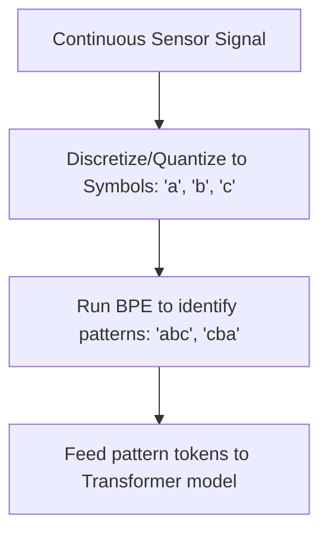

# Time-Series Tokenization

Time-Series Tokenization converts continuous, real-valued sensor signals into discrete sequences of patterns (motifs) using quantization combined with BPE.

## Mechanism
1. **Discretization / Quantization**: Real-valued continuous steps are mapped to a finite set of discrete symbols (e.g. using SAX - Symbolic Aggregate approximation).
2. **BPE Merging**: Apply BPE to the discrete sequence to group adjacent symbols into multi-step pattern sequences.
3. **Reconstruction**: Subwords correspond to typical time-series shapes (like rising, falling, or peak trends).

## Advantages
- **Compresses Time Horizons**: Drastically reduces sequence length compared to point-by-point values.
- **Pattern-Centric Representation**: Captures complex mathematical shapes directly as semantic tokens.

## Limitations
- **Quantization Error**: Converting real numbers to discrete symbols inevitably loses some precision, which can affect forecasting accuracy.

[Back to README](../README.md)
